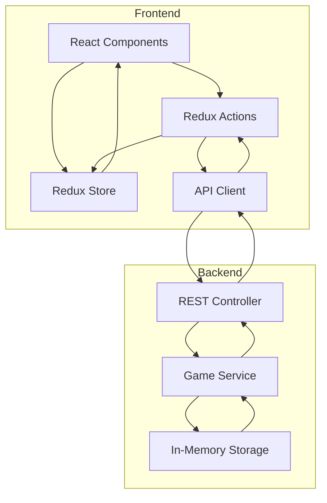

# Design Document: Treasure Hunter Game

## Overview

The Treasure Hunter Game is a full-stack web application consisting of a React+Redux frontend and a Java REST API backend. Players hunt for 3 hidden treasures on a 5x5 grid by strategically revealing positions, guided by proximity hints. The system maintains game sessions in memory, allowing players to resume games by name.

The architecture follows a clean separation between presentation (React), state management (Redux), and business logic (Java backend). The backend handles all game logic including treasure placement, proximity calculations, and session management, while the frontend focuses on user interaction and state visualization.

Key design decisions:
- In-memory storage for simplicity (no database required)
- Session identification via player name (no authentication system)
- Single API call per turn for efficiency
- Proximity algorithm based on orthogonal/diagonal distance metrics

## Architecture

### System Components



### Technology Stack

**Frontend:**
- React 18+ for UI components
- Redux Toolkit for state management
- Axios or Fetch API for HTTP requests
- CSS/SCSS for styling

**Backend:**
- Java 17+ with Spring Boot
- Spring Web for REST endpoints
- Jackson for JSON serialization
- No external database (in-memory storage)

### Communication Flow

1. Player enters name → Frontend calls `/api/game/start` → Backend creates/retrieves session
2. Player selects positions → Frontend calls `/api/game/reveal` → Backend processes turn
3. Backend calculates results → Returns JSON response → Frontend updates Redux store
4. Game completes → Frontend calls `/api/leaderboard` → Backend returns top 10 scores

## Components and Interfaces

### Frontend Components

#### GameContainer
- Root component managing game lifecycle
- Connects to Redux store
- Handles player name input and game initialization
- Renders appropriate child components based on game state

#### PlayerNameInput
- Controlled input component for player name
- Validates non-empty input
- Triggers game start action on submit

#### GameBoard
- Renders 5x5 grid of Position components
- Manages position selection state (up to 3 per turn)
- Disables interaction when game is complete
- Displays turn counter

#### Position
- Individual cell component
- Shows state: unrevealed, treasure, or proximity value
- Handles click events for selection
- Visual indicators for selected/revealed states

#### GameComplete
- Displays final score and completion message
- Shows leaderboard
- Provides option to start new game

#### Leaderboard
- Renders top 10 scores in ascending order
- Displays player names and turn counts

### Redux State Structure

```javascript
{
  game: {
    playerName: string,
    sessionId: string,
    turnCount: number,
    isComplete: boolean,
    board: Position[25], // 5x5 grid flattened
    selectedPositions: number[], // indices of selected positions
    loading: boolean,
    error: string | null
  },
  leaderboard: {
    scores: Array<{playerName: string, score: number}>,
    loading: boolean,
    error: string | null
  }
}
```

### Redux Actions

- `startGame(playerName)` - Initialize or resume game session
- `selectPosition(index)` - Add position to selection (max 3)
- `deselectPosition(index)` - Remove position from selection
- `revealPositions()` - Submit selected positions to backend
- `gameStateReceived(gameState)` - Update store with backend response
- `gameCompleted(score)` - Mark game as complete
- `fetchLeaderboard()` - Request top scores
- `leaderboardReceived(scores)` - Update leaderboard in store

### Backend Components

#### GameController (REST Layer)
- `POST /api/game/start` - Create or resume game by player name
- `POST /api/game/reveal` - Submit positions for revelation
- `GET /api/game/state/{playerName}` - Retrieve current game state
- `GET /api/leaderboard` - Retrieve top 10 scores

#### GameService (Business Logic)
- `createOrResumeGame(playerName)` - Session management
- `revealPositions(playerName, positions)` - Process turn
- `calculateProximity(position, treasures)` - Proximity algorithm
- `checkGameComplete(session)` - Win condition detection
- `recordScore(playerName, score)` - Leaderboard update

#### SessionStorage (In-Memory Storage)
- `Map<String, GameSession>` - Active game sessions keyed by player name
- `List<LeaderboardEntry>` - Completed games sorted by score
- Thread-safe operations for concurrent access

#### GameSession (Domain Model)
- Player name
- 5x5 board state
- Treasure positions (3 coordinates)
- Revealed positions with results
- Turn counter
- Completion status

## Data Models

### Frontend Models

```typescript
interface Position {
  index: number;
  revealed: boolean;
  isTreasure: boolean;
  proximityValue: number | null; // 1-3 or null if unrevealed
}

interface GameState {
  playerName: string;
  sessionId: string;
  turnCount: number;
  isComplete: boolean;
  board: Position[];
  selectedPositions: number[];
}

interface LeaderboardEntry {
  playerName: string;
  score: number;
  rank: number;
}
```

### Backend Models

```java
public class GameSession {
    private String playerName;
    private int[][] board; // 5x5 grid
    private List<Coordinate> treasurePositions; // 3 treasures
    private Map<Coordinate, RevealedPosition> revealedPositions;
    private int turnCount;
    private boolean isComplete;
    private LocalDateTime createdAt;
}

public class Coordinate {
    private int row;
    private int col;
    
    // Validation: 0 <= row, col < 5
}

public class RevealedPosition {
    private Coordinate coordinate;
    private boolean isTreasure;
    private Integer proximityValue; // null if treasure
}

public class LeaderboardEntry {
    private String playerName;
    private int score;
    private LocalDateTime completedAt;
}
```

### API Request/Response Models

```java
// POST /api/game/start
public class StartGameRequest {
    private String playerName; // Required, non-empty
}

public class StartGameResponse {
    private String playerName;
    private int turnCount;
    private List<RevealedPositionDTO> revealedPositions;
    private boolean isComplete;
}

// POST /api/game/reveal
public class RevealPositionsRequest {
    private String playerName;
    private List<Coordinate> positions; // 1-3 positions
}

public class RevealPositionsResponse {
    private int turnCount;
    private List<RevealedPositionDTO> newlyRevealed;
    private boolean isComplete;
    private Integer finalScore; // Only present if complete
}

// GET /api/leaderboard
public class LeaderboardResponse {
    private List<LeaderboardEntryDTO> topScores; // Max 10 entries
}

public class RevealedPositionDTO {
    private int row;
    private int col;
    private boolean isTreasure;
    private Integer proximityValue; // null if treasure
}
```

### Proximity Calculation Algorithm

The proximity system uses Manhattan distance with special rules:

1. **Proximity Value 3**: Position is orthogonally adjacent to a treasure (distance = 1, same row or column)
2. **Proximity Value 2**: Position is diagonally adjacent to a treasure (distance = √2) OR orthogonally adjacent to a Proximity 3 position
3. **Proximity Value 1**: All other positions

Algorithm:
```
For each non-treasure position P:
  minDistance = infinity
  For each treasure T:
    if P and T share row or column and differ by 1:
      return 3 (orthogonally adjacent)
    if P and T differ by 1 in both row and column:
      minDistance = min(minDistance, diagonal)
  
  if minDistance == diagonal:
    return 2
  
  // Check if orthogonally adjacent to any Proximity 3 position
  for each orthogonal neighbor N of P:
    if N has Proximity 3:
      return 2
  
  return 1
```

### Session Persistence Mechanism

Sessions are stored in a `ConcurrentHashMap<String, GameSession>` keyed by player name:

1. When player starts game, check if session exists for that name
2. If exists and not complete, return existing session
3. If exists and complete, create new session (overwrite)
4. If not exists, create new session

This approach allows resumption without authentication but means:
- Multiple players cannot share the same name simultaneously
- Completing a game allows starting fresh with same name
- Server restart clears all sessions

### State Synchronization

Frontend maintains local state in Redux but treats backend as source of truth:

1. User action triggers optimistic UI update (e.g., position selection)
2. Action dispatched to Redux store
3. API call made to backend
4. Backend response updates Redux store with authoritative state
5. UI re-renders based on updated store

Error handling:
- Network failures: Display error, allow retry
- Validation errors: Show message, revert optimistic update
- Session not found: Redirect to name input

